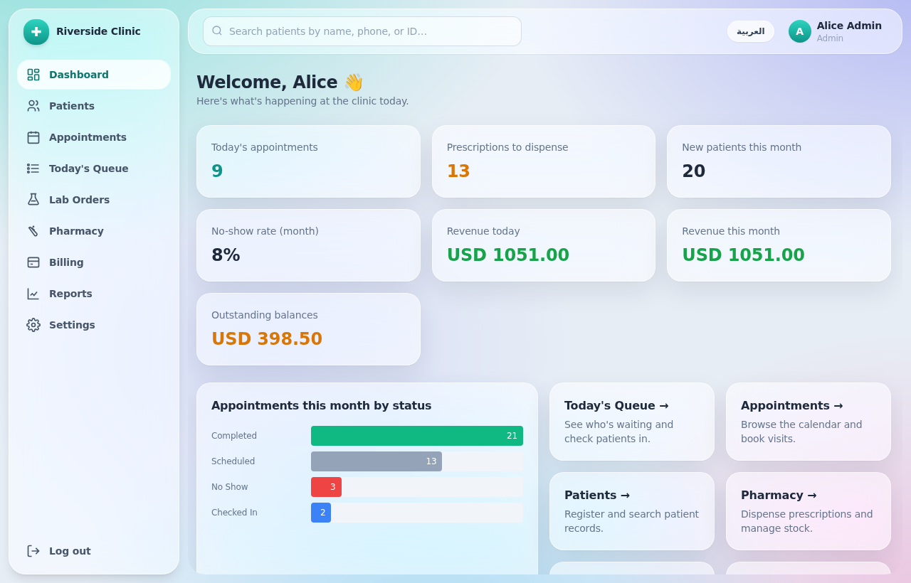

# Riverside Clinic — Clinic Management System

A complete, production-quality web application for small-to-medium medical clinics
(1–20 doctors). It manages patients, appointments, medical records, prescriptions,
lab orders, billing, reporting and clinic settings — simple enough for a
non-technical receptionist to use every day.



---

## ✨ Features

| Module | What it does |
| --- | --- |
| **Patients** | Register, as-you-type search, full profile (visits, prescriptions, invoices, documents), edit, soft-delete (archive), file uploads |
| **Appointments** | Day/week calendar, filter by doctor, book (with inline new-patient registration), **working-hours-aware slot picker** (only shows free slots on days the doctor works), double-booking prevention, statuses, reschedule, cancel with reason, **Today's Queue** |
| **Consultations (EMR)** | Patient summary with allergies/chronic conditions highlighted in red, consultation form (complaint, symptoms, exam, diagnosis + ICD-10, plan, follow-up), append-only notes with **visible edit history** |
| **Vitals** | Weight, height, blood pressure, temperature, pulse — recorded by nurses/doctors |
| **Prescriptions** | Multi-medicine prescriptions linked to a visit, **printable PDF** with clinic header + doctor signature line |
| **Lab orders** | Order from a configurable catalog, status workflow (Ordered → Sample collected → Result ready), text results or **file upload** |
| **Pharmacy** | Full **buy & sell** workflow. **Buy** stock from suppliers (records cost price, supplier bill reference, batch/expiry) so profit margins are tracked. **Sell** to registered patients or walk-in customers with a payment method (cash / card / charge-to-invoice), auto-matching prescribed medicines to inventory and deducting stock in a transaction. Medication inventory with batch/expiry, **cost vs. selling price & margin**, **low-stock & expiry alerts**, audited stock adjustments, and a full **stock-movement ledger**. Sales & purchase history, plus **daily sales, profit and purchase totals** on the dashboard strip |
| **Billing** | Configurable price list, invoices auto-filled from a visit, discounts (amount/%) + tax, payments (cash/card/insurance), partial payments & outstanding balances, **PDF invoice/receipt**, daily cash report |
| **Reports** | **Role-aware dashboard** (financials shown only to admin/reception; doctors and pharmacists get operational KPIs), **inline bar charts**, revenue by doctor/service/method, appointment volume, top diagnoses, outstanding balances — all **exportable to CSV** |
| **Settings (Admin)** | Clinic profile + logo, staff management (create/deactivate/reset password), doctor schedules, price list, lab catalog, **audit log** |
| **Security** | bcrypt-hashed passwords, JWT sessions, **role-based access enforced on the server**, server-side validation (Zod), soft deletes, created/updated timestamps, audit trail |
| **i18n** | English + Arabic with **RTL-ready** layout (toggle in the top bar) |

---

## 🧱 Tech stack

- **Frontend:** React 18 + Vite + TypeScript + Tailwind CSS + React Router
- **Backend:** Node.js + Express + TypeScript
- **Database:** SQLite via Prisma ORM (switch to PostgreSQL by changing one line — see below)
- **Auth:** Email + password (bcrypt), JWT, role-based access control
- **PDFs:** PDFKit (prescriptions, invoices, receipts)

```
Clinic-app/
├── server/                 # Express + Prisma API
│   ├── prisma/
│   │   ├── schema.prisma   # Database schema (all tables)
│   │   └── seed.ts         # Demo data seeder
│   ├── src/
│   │   ├── index.ts        # App entry, route wiring, error handling
│   │   ├── constants.ts    # Role / status constants
│   │   ├── middleware/auth.ts   # JWT + requireRole guards
│   │   ├── utils/          # audit, validation, uploads, PDF helpers
│   │   └── routes/         # auth, patients, appointments, consultations,
│   │                       #   vitals, prescriptions, lab, documents,
│   │                       #   invoices, reports, settings, pharmacy
│   └── uploads/            # Uploaded documents & logos (git-ignored)
└── client/                 # React app
    └── src/
        ├── pages/          # One file per screen
        ├── components/     # Layout, UI kit, forms, modals, icons
        ├── context/        # Auth context
        ├── i18n/           # English + Arabic dictionaries
        └── lib/            # API client, types, formatters
```

---

## 🚀 Getting started

You need **Node.js 18+** (built and tested on Node 22). No external database required —
SQLite runs from a local file, so there's nothing to install or configure.

### ✅ Easiest way — one app on one port (recommended)

Run these three commands from the **project root**, then open one URL:

```bash
npm run setup      # installs everything, creates + seeds the database, builds the UI
npm start          # serves the whole app at http://localhost:4000
```

Open **http://localhost:4000** and log in with a demo account below. In this mode the
Express server serves both the API **and** the built React UI on a single port — no
second terminal, no CORS, no proxy. This is the simplest way to run it locally.

> Re-run `npm start` any time. Only re-run `npm run setup` after pulling new code or to
> reset the demo data.

### 🛠️ Development mode (hot reload, two ports)

For editing the code with instant refresh:

```bash
npm run install:all   # first time only
npm run dev           # API on :4000 and Vite UI on :5173 together (one command)
```

Open **http://localhost:5173**. Vite proxies `/api` to the backend automatically, and
both the server and UI reload on save.

<details>
<summary>Prefer to run each part by hand?</summary>

```bash
# Terminal 1 — backend
cd server && npm install && npm run setup && npm run dev   # http://localhost:4000

# Terminal 2 — frontend
cd client && npm install && npm run dev                     # http://localhost:5173
```
</details>

`npm run setup` (in `server/`) equals `prisma generate && prisma db push && tsx
prisma/seed.ts`. To re-seed later (wipes and repopulates demo data): `npm run seed`.

---

## 🔐 Demo login credentials

The seed script creates these accounts (also printed to the console when seeding).
On the login screen you can **click any demo card to auto-fill** the fields.

| Role | Email | Password |
| --- | --- | --- |
| **Admin** | `admin@clinic.com` | `admin123` |
| **Doctor** (General Practice) | `dr.smith@clinic.com` | `doctor123` |
| **Doctor** (Pediatrics) | `dr.jones@clinic.com` | `doctor123` |
| **Receptionist** | `reception@clinic.com` | `reception123` |
| **Nurse** | `nurse@clinic.com` | `nurse123` |
| **Pharmacist** | `pharmacy@clinic.com` | `pharmacy123` |

Seed data also includes: 1 clinic profile, 20 sample patients, this week's
appointments (with vitals, consultations, prescriptions and invoices for completed
ones), a price list, a lab-test catalog, and a **pharmacy inventory of 15
medications** (some deliberately low-stock or expiring soon) with a few
prescriptions already dispensed — so you can explore immediately.

---

## ⚙️ Configuration

Backend config lives in `server/.env`. It is created automatically from
`server/.env.example` the first time you run `npm run setup` or `npm run dev`, with
these working local-dev defaults:

```
DATABASE_URL="file:./dev.db"
JWT_SECRET="change-this-in-production-..."
PORT=4000
CLIENT_ORIGIN="http://localhost:5173"
```

> **Change `JWT_SECRET` before any real deployment.**

### Hosting on Supabase / PostgreSQL

A ready-to-use Postgres path is included — the app code doesn't change:

- **`server/prisma/schema.postgres.prisma`** — the Postgres schema (mirrors the
  SQLite one; only the datasource differs).
- **`supabase/schema.sql`** — the complete table DDL (all 22 tables, indexes and
  foreign keys) to paste into the Supabase SQL Editor.
- **`supabase/enable-rls.sql`** — optional Row Level Security hardening.

Full step-by-step instructions are in **[SUPABASE.md](SUPABASE.md)**. In short:
set `DATABASE_URL` + `DIRECT_URL` to your Supabase connection strings, run
`supabase/schema.sql` (or `npm run prisma:pg:push`), then
`npm run setup:supabase` to generate the client and seed demo data.

### Local MySQL with XAMPP / phpMyAdmin

Prefer to manage the data in **phpMyAdmin**? A beginner-friendly, step-by-step guide
is in **[MYSQL-PHPMYADMIN.md](MYSQL-PHPMYADMIN.md)**. It uses
`server/prisma/schema.mysql.prisma` and a ready-to-import **`mysql/schema.sql`**
(all 22 tables) that you load straight from the phpMyAdmin *Import* tab.

---

## 🔒 Security notes

- Passwords are hashed with **bcrypt** — never stored in plain text.
- Every API route requires authentication except `POST /api/auth/login`.
- **Role checks run on the server** (`requireRole` middleware), not just in the UI.
- **`helmet`** sets security headers and **login is rate-limited** (10 attempts / 15 min / IP) to blunt brute-force attacks.
- Financial figures (revenue, balances) are withheld from the API for roles that shouldn't see them, not merely hidden in the UI.
- All forms are validated server-side with **Zod**.
- Patients, appointments and invoices are **soft-deleted** (archived), never hard-deleted.
- Every record carries created/updated timestamps and a created-by user.
- An **audit log** records logins, edits, deletions and payments.

> ⚠️ Real clinic software must comply with your country's health-data privacy laws
> (e.g. HIPAA in the US). Have a professional review security before storing real
> patient data. This project is a strong starting point, not a certified product.

---

## 📖 How each role uses the system

See **[ROLE_GUIDE.md](ROLE_GUIDE.md)** for a plain-language walkthrough of a typical
day for the admin, receptionist, nurse and doctor.
